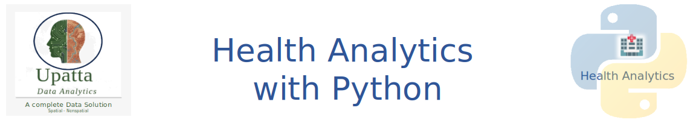

{fig-align="center" width="100%"}

Welcome to **Health Analytics with Python** — a comprehensive tutorial series for health informatics professionals, clinical data scientists, epidemiologists, and graduate students who want to apply Python rigorously to healthcare problems.

Python has become the language of choice for health data scientists because of its rich ecosystem spanning statistics, machine learning, natural language processing, geospatial analysis, and production deployment. This series takes you from foundational EHR data handling through statistical inference, machine learning, clinical NLP, causal inference, geospatial epidemiology, and production deployment.

**Modules:** 8 modules · 61 notebooks · ~450 code cells  
**Level:** Intermediate to Advanced · Healthcare data science background assumed  
**Language:** Python 3.10+ · Colab-compatible  
**Dataset:** Synthetic (MIMIC-III inspired) · seed = 42 throughout  
**Author:** Dr. Zia U. Ahmed · [Upatta Analytics](https://github.com/zia207)

## Why Health Analytics with Python?

Healthcare generates more data per person than almost any other industry — electronic health records, claims databases, imaging, genomics, wearables, and administrative files — yet much of it remains under-analysed. **This series bridges three gaps that most textbooks leave open:**

1. **Clinically meaningful examples** — every dataset, model, and metric is grounded in real healthcare problems: readmission prediction, drug optimisation, spatial health inequities, and causal treatment effects.
2. **End-to-end thinking** — notebooks do not stop at model accuracy. They continue through calibration, fairness, explainability, API serving, monitoring, and clinical governance.
3. **Reproducibility by design** — code is written as it would be in a health system data science team: version-pinned environments, SHA-256 data manifests, logged pipelines, and CI/CD-ready test suites.

## Series Architecture

The eight modules form two learning tracks that can be taken independently or sequentially.

| Track | Modules | Focus |
|-------|---------|-------|
| **Track A — Pharmacy & Clinical Analytics** | 01–05 | Python foundations → EDA → statistical inference → machine learning → clinical NLP |
| **Track B — Population Health & Deployment** | 06–08 | Causal inference → geospatial epidemiology → reproducible research and deployment |

Each module contains multiple notebooks following a consistent arc: **Concepts → Core method → Case study → Extension → Capstone**.

## Getting Started

1. Browse notebooks using the **sidebar** on the left — modules are organised by track.
2. Clone the [GitHub repository](https://github.com/zia207/Health-Analytics-with-Python) to run notebooks locally or in Google Colab.
3. Start with the [Series Overview](MOD00_NTRO_HealthPy_Tutorial_Series.ipynb) notebook for the full module guide.
4. **Module 07 applied case study:** [NB-09 · Spatial ML — LBC Mortality (Northeast)](MOD07_NB09_Spatial_ML_LBC_Northeast.ipynb) — real county data, hot-spot analysis, GWR, and GW-RF.

```bash
git clone https://github.com/zia207/Health-Analytics-with-Python.git
cd Health-Analytics-with-Python
pip install -r requirements.txt
jupyter lab
```

## Who Is This For?

> Health informatics professionals, clinical data scientists, epidemiologists, public health researchers, and graduate students who know Python basics and want to apply it rigorously to healthcare problems.

If you are new to Python, you may want to start with [Python for Beginners](https://python-beginners-zia207.netlify.app/) before diving into this series.
